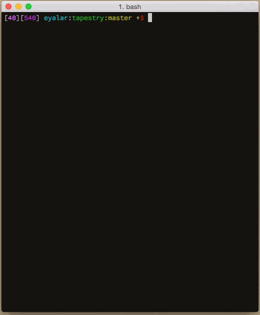
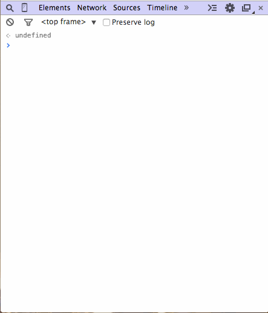

A minimal JavaScript testing framework for frontends and backends.

## Goals

0. Easy to test with.
0. Easy to extend.
0. Handle sync/async tests.
0. Group tests into suites.
0. Enable nesting test suites.
0. Tests are runnable scripts.
0. Run both in browser and node.
0. Have an optional [TAP](http://testanything.org/) producer.

## Demo

See [demo.js](demo.js) for current functionalities.

